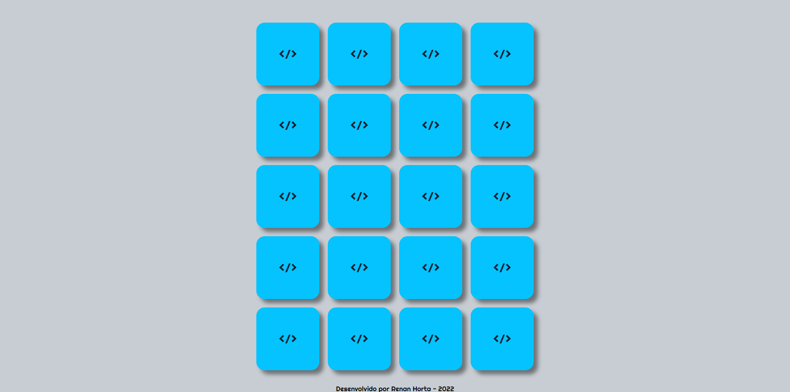
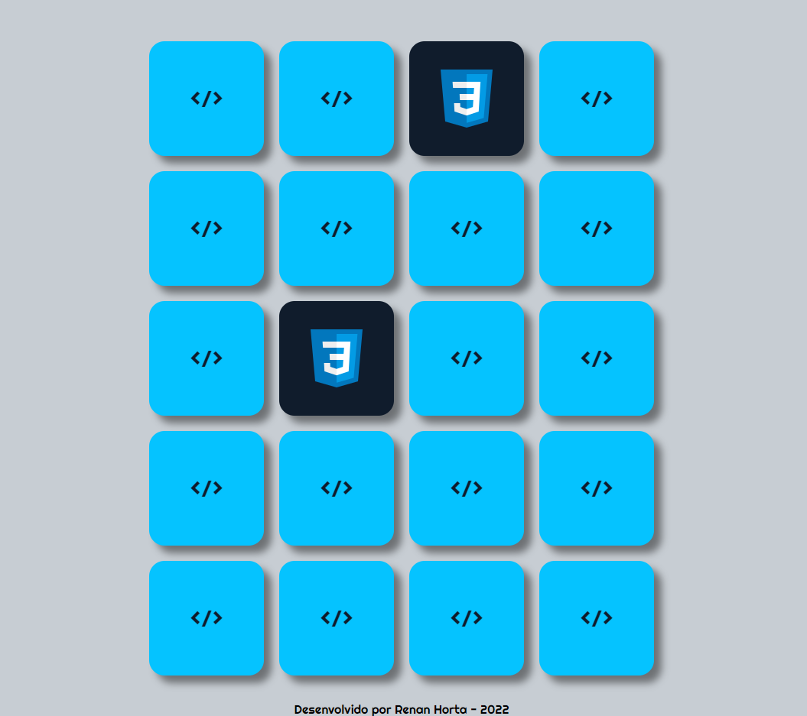

Projeto de estudo criando um jogo da memória simples. Com Js, CSS e html.
VocÊ pode entrar no projeto por nesse <a href="https://renanhorta.github.io/projeto_jogo-da-memoria/" target="_blank">link</a>

<h1 align="center">
 
  
  
 
 
Jogo da Memória
</h1>

  Você pode entrar no projeto clicando nesse <a href="https://renanhorta.github.io/projeto_jogo-da-memoria/" target="_blank">link</a>

